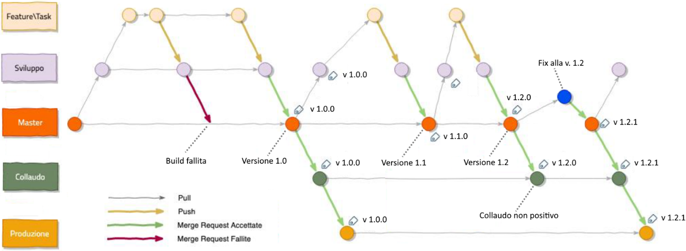

# DevOps

DevOps is a methodology in the software development and IT industry. 

Used as a set of practices and tools, DevOps integrates and automates the work of software development (Dev) and IT operations (Ops).

Here you will find some tools and configuration examples for setting up a devops environment.

The examples refer to the `wdemo` project present in the repository `https://github.com/giosil/multi-rpc`.

## Usual procedure to deploy a release

Suppose we start from this situation:

- `git branch`

```
  collaudo
  master
  produzione
* sviluppo
```

Proceed with the merge `sviluppo` -> `master`:

- `git checkout master`
- `git merge sviluppo`

If there are conflicts, resolve them and execute:

- `git add .`
- `git commit -m "update"`

Otherwise execute:

- `git push --set-upstream origin master`

Proceed with the merge `master` -> `collaudo`:

- `git checkout collaudo`
- `git merge master`

If there are conflicts, resolve them and execute:

- `git add .`
- `git commit -m "update"`

Otherwise execute:

- `git push --set-upstream origin collaudo`

Return to the development branch:

- `git checkout sviluppo`

Proceed with the creation of the merge request `collaudo` -> `produzione` (protected branch).



## Contributors

* [Giorgio Silvestris](https://github.com/giosil)