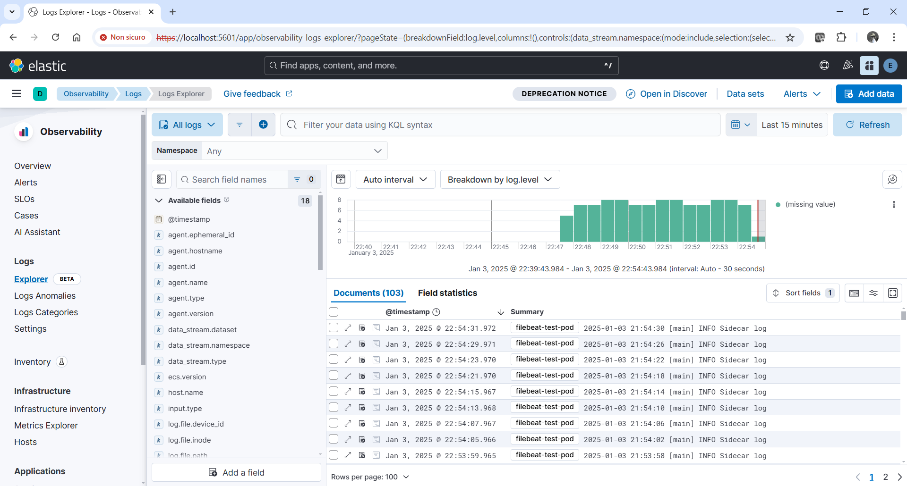

# Install Elasticsearch and Kibana using Helm

## Install custom resource definitions

`kubectl create -f https://download.elastic.co/downloads/eck/2.16.0/crds.yaml`

## Install ECK operator

`kubectl apply -f https://download.elastic.co/downloads/eck/2.16.0/operator.yaml`

## Add elastic Helm repository

`helm repo add elastic https://helm.elastic.co`

`helm repo update`

## Check images version tag

`helm show values elastic/eck-stack`

`helm template es-kb-quickstart elastic/eck-stack`

Es. 8.17.0

## Pull images

`docker pull docker.elastic.co/elasticsearch/elasticsearch:8.17.0`

`docker pull docker.elastic.co/kibana/kibana:8.17.0`

`docker pull docker.elastic.co/beats/filebeat:8.17.0`

## Install Elasticsearch and Kibana

`helm install es-kb-quickstart elastic/eck-stack -n elastic-stack --create-namespace`

with kibana Ingress enabled:

`helm install es-kb-quickstart elastic/eck-stack -n elastic-stack --create-namespace --set=eck-kibana.ingress.enabled=true --set=eck-kibana.ingress.class=nginx --set=eck-kibana.ingress.hosts[0].host=kibana.dew.org --set=eck-kibana.ingress.hosts[0].path="/"`

or create a separate Ingress:

`kubectl apply -f kibana_ingress.yaml -n elastic-stack`

```yaml
apiVersion: networking.k8s.io/v1
kind: Ingress
metadata:
  name: kibana-ingress
  namespace: default
  annotations:
    nginx.ingress.kubernetes.io/backend-protocol: "HTTPS"
    nginx.ingress.kubernetes.io/ssl-passthrough: "true"
    nginx.ingress.kubernetes.io/force-ssl-redirect: "true"
spec:
  ingressClassName: nginx
  rules:
  - host: kibana.dew.org
    http:
      paths:
      - path: /
        pathType: ImplementationSpecific
        backend:
          service:
            name: es-kb-quickstart-eck-kibana-kb-http.elastic-stack
            port:
              number: 5601
```

## Get password of 'elastic' user

`kubectl get secret elasticsearch-es-elastic-user -o json -n elastic-stack`

`kubectl get secret elasticsearch-es-elastic-user -o go-template='{{.data.elastic | base64decode}}' -n elastic-stack`

eKBMm094QUvW1v5Cc5pL5976

Copy value to put in ConfigMap filebeat-config of `filebeat.yaml`

## Get certificate

`kubectl get secret elasticsearch-es-http-certs-public -o json -n elastic-stack`

`kubectl get secret elasticsearch-es-http-certs-public -o yaml -n elastic-stack`

Copy `tls.crt` to put in Secret filebeat-es-certs of `filebeat.yaml`

## Check services

`kubectl get service -n elastic-stack`

`kubectl get service elasticsearch-es-http -n elastic-stack`

From other namespaces of the same cluster host is <service-name>.<namespace>:

elasticsearch-es-http.elastic-stack

`kubectl port-forward service/elasticsearch-es-http 9200 -n elastic-stack`

https://localhost:9200

https://localhost:9200/_cat/indices?v=true&s=index

https://localhost:9200/_cat/indices?format=json

`kubectl get service es-kb-quickstart-eck-kibana-kb-http -n elastic-stack`

`kubectl port-forward service/es-kb-quickstart-eck-kibana-kb-http 5601 -n elastic-stack`

https://localhost:5601

## Install filebeat

First modify filebeat.yaml with generate credential, certificate.

`kubectl apply -f .\filebeat.yaml`

`kubectl delete -f .\filebeat.yaml --grace-period=0 --force`

Check indexes starts with .ds-filebeat:

https://localhost:9200/_cat/indices?v=true&s=index

https://localhost:9200/.ds-filebeat-8.17.0-2025.01.03-000001/_search

## View log on kibana



